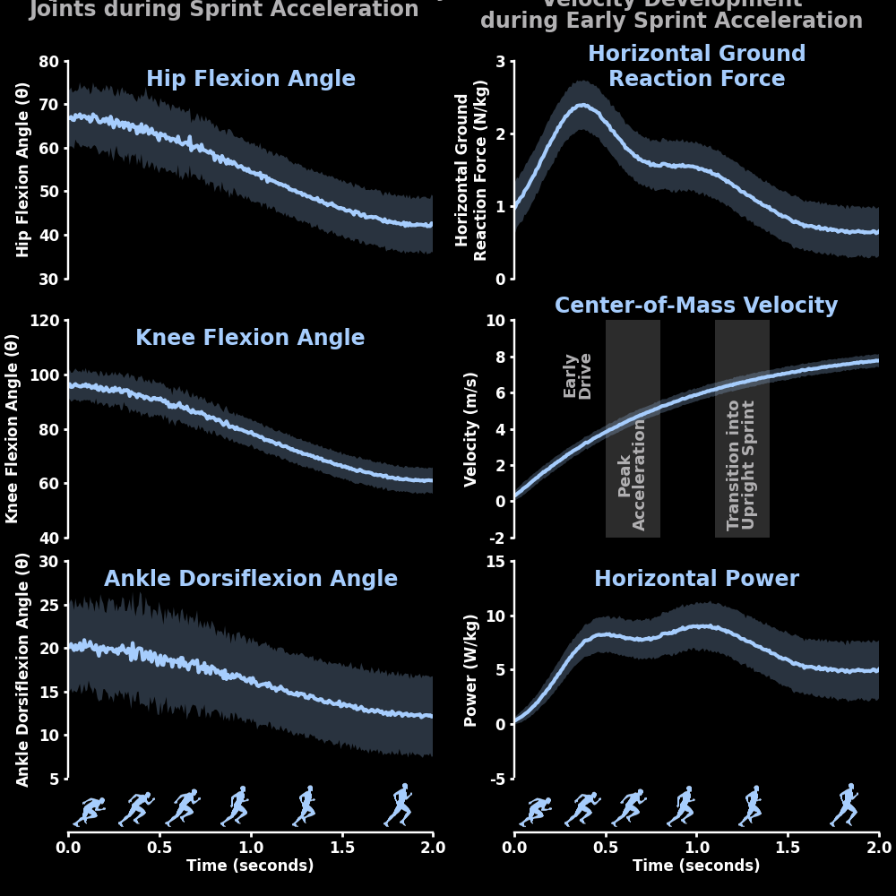

# Biomechanics_Builder

*   [Sport Biomechanics](#getting-started)
*   [Configuration](#configuration)
    *   [Option A](#option-a)
    *   [Option B](#option-b)
*   [Contributing](#contributing)

## Sport Biomechanics
🏈🏀⚾
Temporal Analysis of Athletic Performance & Injury Risk. Here, I've created mock data of atheltes initiating sprint accelerations, jump shots, and pitches. With this data, I designed data visualizations with an X-AXIS (time) that depicts a silhouette of the corresponding action to the plotted data. The opaque, solid line indicates the temporal mean across athetes, and the transparent regions are the +/- the temporal standard deviation between athletes. `change_figure_panel_colors()` changes the color masking the graphs and X-AXIS silhouettes.

⚠️ Disclaimer: These datasets in the `mock data` data folder are synthetic and intended for demonstration and educational purposes only. They are not derived from real athlete data and should not be used for clinical or performance decision-making.

## Configuration

... content ...

### Option A

... content ...

### Option B

... content ...

## Contributing

... content ...
